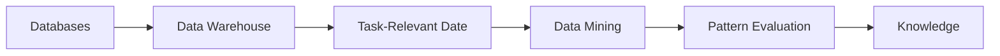
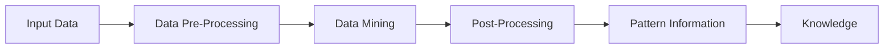

# Concepts and Techniques

## Book

Dat Mining : Concepts and Techniques by Jiawei Han (2023)

## Chapter 1

If each record has a label it's called supervised and therefore Machine Learning. We split the data in two parts : 
- 80% for training
- 20% for testing

Else it's called
Data Mining : knowledge discover from data (KDD)
Extracting interesting patterns or knowledge from a hudge amount of data
- Non-trivial
- Implicit
- Previously unknown 
- Potentially useful
Paterns

Expert systems won't be able to do data mining.

All data must be in numeric format except the label

### Mining vs. exploration

Term|Definition
-|-
Exploration|do statistical analytics on data
Mining|find new knowledge on data

Technique | Algorithm
-|-
Categorisation|KNM & Decision Tree
Clustering|KMeanClustering & DBScan 

### Machine Learning vs. Deep Learning

Deep Learning will do data preparation and classification in one model

Famous neural network algorithm : feed-forward, convolutional, recurrent, graph,...

### Outliers Detection

Remove the extremum data, noise or exception
