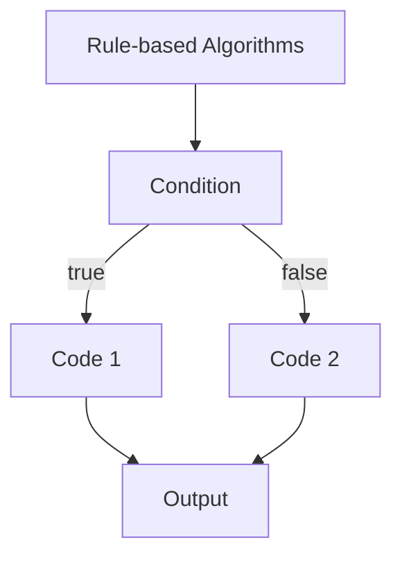
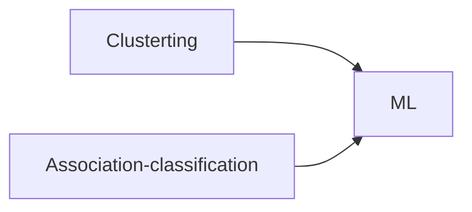
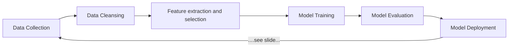

# Tests
Type|Date
-|-
Test |18/07/2023
Exam + Project Progress|20/07/2023

# Chapitre 1

Data Engeneering has a role every step of the data cycle.

5 modes of analytics :
- Descriptive
- Real-Time
- Diagnostic
- Perdictive
- Prescriptive

## Machine Learning Algorithms

Machine learning : is a study of learning algorithms

Prescriptive : analytics then decision then action

Rules based algorithms vs. Machine Learning

Task|Type|Output
-|-|-
classification|prediction|discrete catogory values
regression|prediction|countinous numbers
clustering|descriptive|labels
association-classification|descriptive|labels

We need to have label, so we can use :

Type of learning :
- Supervised 
- Unsupervised
- Semi-supervised
- Reinforcement : feedback loop

Clustering Similarity Measure : 
- Inter-cluster distances should be maximal
- Intra-cluster distances should be minimal

## Machine learning process

## Tests

Dataset : the all corpus

We need 3 sets :
- Training set : used to train the model (80%)
- Test set : evaluated the model (20%)
- (optional) Validation set : used during the training from the training see

Difference between training set end test set :
- training : show labels + feetures
- test : hide the labels + features

Annotation/Labeling : 
- can be done by human on emotional type

Type|Methods
-|-
Parameters|automatically learned by models
Hyperparameters|manually sets

## Validation Methods

Validation process = tuning parameters

Methods | Definition
-|-
Holdout/Stratified | train-test-split (without validation)
Cross Validation | involve the validation set. It's using all the data set as validation and training during the iteration
K-Fold Cross Validation (k - cv) | k is the number of holdout / split I want to use. Studies says that k must be between 3 and 10

## Generalization capability

Checks the capabitly of trained/tested models

Bias (accuracy):
- Diffrenece between the expected and the result
- Error due to inaccurate assumptions/simplifications

Variance (precision):
- how precise the model is between different training set 

The best is to have as minimum variance and bias as possible

## Model validity

Errors|Definition
-|-
training|when you run the model on the training data
generalization|when you run the model on new a dataset. We want to be the minimum as posible 

## Fitting

Fitting|Definition
-|-
Underfitting|haven't learn on all feature
Good|have learn 
Overfitting|haven't find a simple model for the data set

### Bias-Variance Trade-off

The more the complexity is the less bias we have but the more variance we get. 

## Machine Learning Performance Evaluation - Regression

Residual : difference between the expected and the result

Mean Absolute Error
Mean Square Error

## Machine Learning Performance Evaluation - Classification

Cost of finding (precision) : TP / TP + FP

Cost of not finding (recall) : TN / TN + FN

If the data are unbalances the accuracy calculation is not usefull because we trained the data mainly on only one class of data.

ROC : is the graph with the true positive rate vs. false positive rate

The bigger the area is under the curve the better the model is 

## Occam's Razor

If you have two models with the same accuracy : always go with the simplest one.