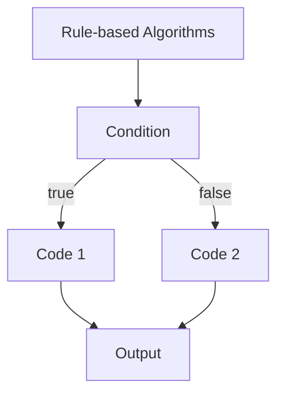
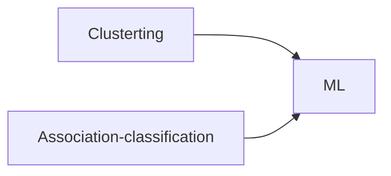
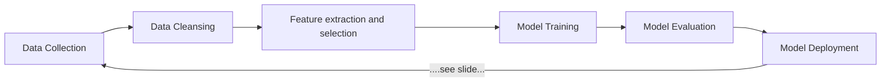

# Tests
Type|Date
-|-
Test 1|8/07/2023
Exam + Project Progress|20/07/2023

# Chapitre 1

Data Engeneering has a role every step of the data cycle.

5 modes of analytics :
- Descriptive
- Real-Time
- Diagnostic
- Perdictive
- Prescriptive

## Machine Learning Algorithms

Machine learning : is a study of learning algorithms

Prescriptive : analytics then decision then action

Rules based algorithms vs. Machine Learning

Task|Type|Output
-|-|-
classification|prediction|discrete catogory values
regression|prediction|countinous numbers
clustering|descriptive|labels
association-classification|descriptive|labels

We need to have label, so we can use :

Type of learning :
- Supervised 
- Unsupervised
- Semi-supervised
- Reinforcement : feedback loop

Clustering Similarity Measure : 
- Inter-cluster distances should be maximal
- Intra-cluster distances should be minimal

Machine learning process :

Dataset : the all corpus

We need 2 sets :
- Training set : used to train the model (80%)
- Test set : evaluated the model (20%)
- (optional) Validation set : used during the training from the training see

Difference between training set end test set :
- training : show labels + feetures
- test : hide the labels + features

Annotation/Labeling : 
- can be done by human on emotional type

Type|Method
-|-
Parameters|automatically learned by models
Hyperparameters|manually sets

Validation process : tuning parameters

Holdout/Stratified: train-test-split (without validation)

Cross Validation : involve the validation set. It's using all the data set as validation and training during the iteration.

K-Fold Cross Validation (k - cv) : k is the number of holdout / split I want to use.
