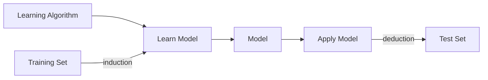

# Chapitre 2

Data Type|Output|Method
-|-|-
Categorical Data|Historical|Data Classification
Continous Data|Prediction|Regression

Mis-classification : not label as expected
Induction = training

## Classification

Classification Type|Number of classes|Number of attributes by classes
-|-|-
Binaries|2|1
Mutliple|n|1 
Multilabel|n|n

DataSet : MNIST

## Regression

Linear Regression : a statistiscal analysis method to determine the quantitave relationship between two ore more variables 

axis|name
-|- 
x|independante variable
y|dependante variable 

Prediction function is the line that split the variable, y = ax + b with a the transformation coefficient and b the bias.

### Linear

Root Mean Square Function / J Function

Mutliple Linear Regression

y = B + B1 x1 + ... + epsilon

### Gradient Descent

The goal is to diminush the dimension

- alpha : learning gradient
- cost function : sum of the residual

<b>SEE THE LINK IN SLIDES (youtube)</b>

Implementation :
- Batch Gradient Descent : uses the samples in all dataset each time
- Stochastic Gradient Descent : randomly selects a sample in a dataset each time 
- Mini-Btch grandient Descent : conbines of BGD and SGD, using a certain amount of sample each time

### Polynomial 

Depends on the distribution, can choose how many degree we want.

- Ridge Regression : to avoid overfitting and mitigate the error
- Lasso Regression :
- Elastic Net : combine both

Early stopping : automatic detect overfitting by detect error curve

### Logistical Regression

Definition : is a classifier with the categorical data converted to continous with the output as a probability

Getting the probability and using a S shape.

It's a logarithm of the regression.