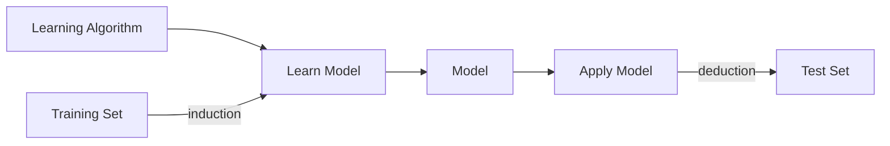

# Chapitre 2

Data Type|Output|Method
-|-|-
Categorical Data|Historical|Data Classification
Continous Data|Prediction|Regression

Mis-classification : not label as expected
Induction = training



## Classification

Classification Type|Number of classes|Number of attributes by classes
-|-|-
Binaries|2|1
Mutliple|n|1 
Multilabel|n|n

DataSet : MNIST

## Regression

Linear Regression : a statistiscal analysis method to determine the quantitave relationship between two ore more variables 

axis|name
-|- 
x|independante variable
y|dependante variable 

Prediction function is the line that split the variable, y = ax + b with a the transformation coefficient and b the bias.

### Linear

Root Mean Square Function / J Function

Mutliple Linear Regression

y = B + B1 x1 + ... + epsilon

Continous output

### Gradient Descent

The goal is to diminush the dimension

- alpha : learning gradient
- cost function : sum of the residual

<b>SEE THE LINK IN SLIDES (youtube)</b>

Implementation :
- Batch Gradient Descent : uses the samples in all dataset each time
- Stochastic Gradient Descent : randomly selects a sample in a dataset each time 
- Mini-Btch grandient Descent : conbines of BGD and SGD, using a certain amount of sample each time

### Polynomial 

Depends on the distribution, can choose how many degree we want.

- Ridge Regression : to avoid overfitting and mitigate the error
- Lasso Regression :
- Elastic Net : combine both

Early stopping : automatic detect overfitting by detect error curve

### Logistical Regression

Definition : is a classifier with the categorical data converted to continous with the output as a probability

Getting the probability and using a S shape.

It's a logarithm of the regression.

Binary output

## Support Vector Machine (SVM)

Binary output

Linear and non-linear classification, regression and outlier detection

Here, we are looking to the best modele : with the largest margin
The larger the margin the better the classification is.

The support vector are the point near the border of the margin

Threshold : equidistante from the closest class A point and the closest class B point

#### Terminology

1. Support Vectors : points of the data that are shown at the edges of the margin

2. HyperPlan Spreded Data : nD

Point Spreded Data : 1D\
Linear Spreded Data : 2D\
Plan Spreded Data : 3D

3. Maximum Margin Classifier : it doesn't not allow noise at the margin

#### Margin

Optimal : ax + b = 0
Positive margin : ax + b = -1
Negative margin : ax + b = 1

Margin or weight : M = 2 / ||slop||
We want to have max(M)

Example of fit : it's were the threshold and margin are optimal

Support Vector Classifier : positive margin point and negative margin point
- Hard Margin : no error are allowed 
- Soft Margin : few errors are allowed

Hyperparameters :
- Slack Variable : allow a number of errors
- C Variable : penalty strength for errors

kernel = 'linear' means the separator will be a line

#### Data Linearity

Seperability Issue :  if there is no threshold without error/noise. 

We can add a Dimension to redistribute the data. Not a Feature, it's a "fake dimension" created to separate the object.

Phi : 
- kernel define the way we want to split the classes.
- <b>A kernel transforms an input data space into the required form</b>

After dimensional incresed we can use SVM.

RBF (Radial Basic Function) and Gaussian RBF :
- gamma hyperparameters : checking the influence if one training set 

Non-Linear SVM Data


#### Grid Search

```python 
param_grid = {'C' : [0.1, 1, 10, 100], 'gamma': [1, 0.1, 0.001, 0.0001, 10]}
```

We make a model training with each combinaison of values and define the one with the less.

#### Regression

Continous type : we look for data between the margin and make a 
SVM can be used on small dataset and dataset with little noise
