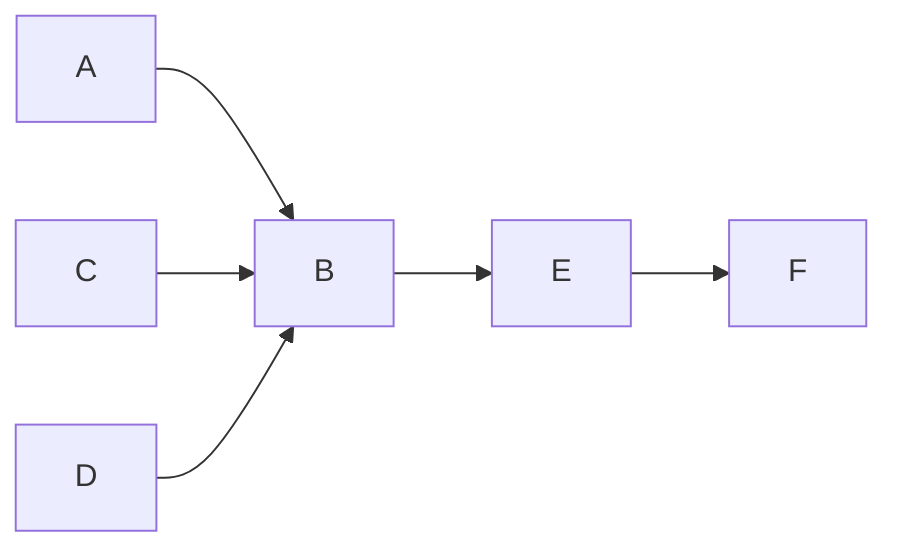

# Chapiter 5

ANN : Artificial neurone network
Deep Learning 

Why today its huge ?

Huge Amount of Data
Increase in computing power
Training algorithms have been improved
Funding and progress 

Perceptron

Perceptron -> Activation Function

Number of layer = n - 1 (the input layer)
Fully connected model = all the input are connected to all neuromne 

Weight -> randomly generated

Deep Learning is a part of ANN (Artificial Neural Network)

End 2 End learning : don't have to spend time on pre-processing (feature selection, dimension reduction, data selection)

Feet-Forward -> Layer to layer until the end
Back-Propagation -> To fix the error by adjusting the weights

And it can goes end to end until the desire error level an the desire output

Multi-Layer Perceptron -> used to solve the XOR

Shadow network -> 1 hidden layer
Neurone network -> n hidden layer

Derivative of the lose function (with is the errors : the output - the expected) will be use to adjust the weight of each lines with gradient descent (alpha)

# Activation Function

Sigmoid : monotonic function + increase in the result -> 1 / 1 + e^-x
ReLU (Rectified Linear Unit) -> solve the Vanishing Gradient and Exploiding Gradient issue due to its derivative function

Vanishing Gradient -> when the weight of the neurone reach zero
Exploiding Gradient -> the value of the weight became too big

Revoir les gradients descent

KERAS (API on top of Tensorflow) or TensorFlow (Google) or PyTorch (facebook)

Dense layer -> a layer witch is connected to all layers

There is to much parameter / possibility... see the lecture for hyperparameter values

Epoch = 1 its 1 foreward + 1 backward

Validation et Errors mesure must have the same coef directeur if not its overfitting

# Binary Cross Entropy

# Gradient Cliping

The first layer have useualy more neurone than the next, so to gain time we can get save only the first layers.

Dropped-out : we can remove neurons to avoid the overfit

# RNN & CNN

1. RNN : recurrent neural network
-> when we need to have intel about the previous outputs, task depend on the memorie

ex : sentiment analysis, semantic analysis

LSTM : long short term memory
-> more memorie length

Embedings -> world2vec, birth etc...

DeepLearning models where invented for better embeding 

2. CNN : convolutional neural network

Data Augmentation -> apply transformation to to datum

Convolotional = apply a filter on the row to reducing the number of feature n times 

We learn all features to generate the output