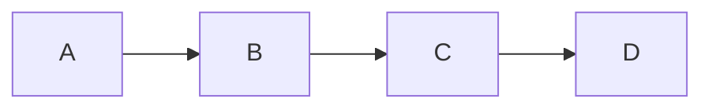
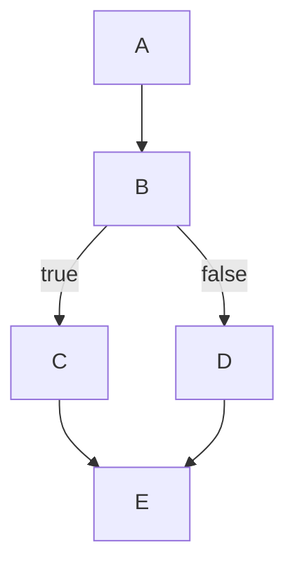
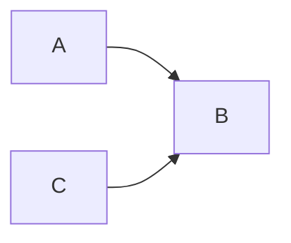

```mermaid
    graph LR;
        A[A] --> B[B];
        B[B] --> C[C];
        C[C] --> D[D];
```

```mermaid
    graph TD;
        A[A] --> B[B];
        B[B] -- true --> C[C];
        B[B] -- false --> D[D];
        C[C] --> E[E];
        D[D] --> E[E];
```

```mermaid
    graph LR;
        A[A] --> B[B];
        C[C] --> B[B];
```